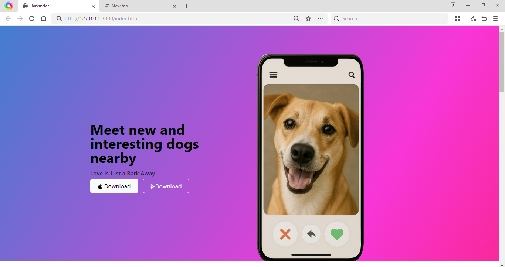
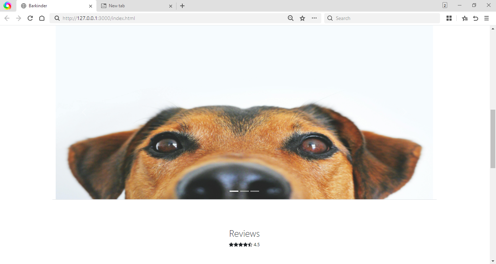

# Barkinder  (Project) - find your perfect match

 Barkinder is a fun, demo one-page website inspired by Tinder - but for dogs!
 This project designed to showcase frondend development skills using HTML5, CSS3, Bootstrap.
 With help of meadia query responsiveness added.
 Swipe feature are not included - this is a static, non-functional mock-up for portfolio.

 ---

 ## Project Screenshot
 ### Homepage
 
 
 ### Match Profile Section
 

 ### Review Section
 

 ### Pricing Section
 

 ## Built with

 - HTML5
 - CSS3 (including meadia queries)
 - Bootstrap
 - Responsive Design

 ---

 

